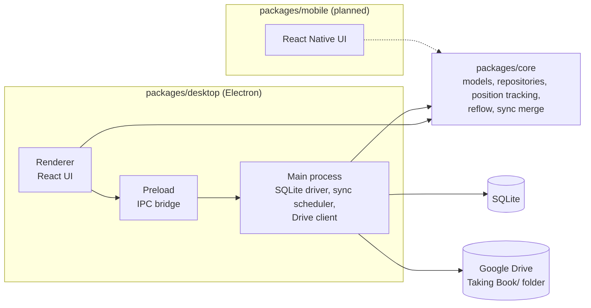

# Taking Book

A distraction-free, local-first document reader with optional Google Drive sync.

## Architecture



`core` is platform-agnostic: SQLite and Drive access are injected by the
platform packages, and platforms never import from each other.

| Package | Description | Status |
| --- | --- | --- |
| `packages/core` | Shared logic (see [AGENTS.md](./AGENTS.md)) | Active |
| `packages/desktop` | Electron app: library, reader, sync | Active |
| `packages/mobile` | React Native app | Planned |

## Quick start

```bash
npm install
npm run build   # builds @taking-book/core; required before typecheck/start
npm test

cd packages/desktop
TB_DISABLE_GPU=1 npm start   # TB_DISABLE_GPU only for VMs/containers
```

Verification: `npm run build && npm run typecheck && npm run lint && npm test`.

## Docs

- [AGENTS.md](./AGENTS.md) — coding rules
- [CONTEXT.md](./CONTEXT.md) — domain glossary
- [docs/shortcuts.md](./docs/shortcuts.md) — keyboard shortcuts
- [docs/google-drive-setup.md](./docs/google-drive-setup.md) — cloud sync setup
- [docs/releasing.md](./docs/releasing.md) — cutting a release
