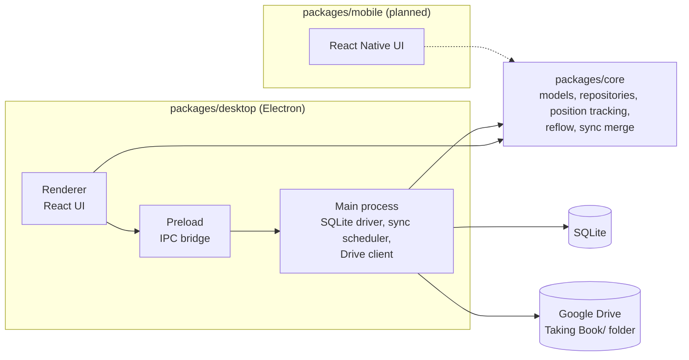

# Taking Book

A distraction-free, local-first document reader with optional Google Drive sync.

## Download

Get the latest version from the
[Releases page](https://github.com/vihao1802/taking-book-desktop-app/releases/latest)
and pick the file for your system under **Assets**.

| System | File | Install |
| --- | --- | --- |
| Windows | `taking-book-desktop-app-<version>.Setup.exe` | Run the installer. Windows SmartScreen may say "Unknown publisher" because the app is not code-signed: click **More info**, then **Run anyway**. |
| macOS (Apple Silicon: M1 or newer) | `.zip` with `darwin-arm64` in its name | Unzip it and drag the app to **Applications**. The app is not notarized, so the first time, right-click it and choose **Open**, then **Open** again. Intel Macs are not supported yet. |
| Linux (Debian/Ubuntu) | `taking-book-desktop_<version>_amd64.deb` | Copy it to `/tmp` and install it from there: `cp taking-book-desktop_<version>_amd64.deb /tmp/ && sudo apt install /tmp/taking-book-desktop_<version>_amd64.deb`. Installing straight from `~/Downloads` also works but prints a harmless "Download is performed unsandboxed as root" note, because apt's `_apt` user cannot read your home folder. |

Your library stays on your device; Google Drive sync is optional.

Android has its own steps: see [Install on Android](#install-on-android).

**Upgrading:** the app tells you when a newer version is out. Download it and
install it the same way; your library, Notes and settings are kept.

## Install on Android

The Android app is a signed `.apk` named `taking-book-<version>.apk` under
**Assets** on the same release page. It is not on Google Play, so Android asks
for a few confirmations. Android 10 or newer is required.

1. On the phone, open the release page and tap the `.apk` to download it. If the
   browser warns that this type of file can be harmful, choose **Download anyway**.
2. Open the downloaded file. Android says your browser (or file manager) is not
   allowed to install unknown apps: tap **Settings**, turn on **Allow from this
   source**, go back and tap **Install**. You can turn the setting off again
   afterwards.
3. Google Play Protect may show **App blocked** or **Unsafe app blocked** because
   the developer is not known to Play. It means Google has not reviewed the app,
   not that it found malware. Tap **More details**, then **Install anyway**. If
   Play Protect only offers to scan the app, tap **Scan app** or **Install without
   scanning**.
4. Open **Taking Book** once the install finishes. To update, install the newer
   `.apk` the same way over the old one; your library is kept.

**Android developer verification.** Google is rolling out a check that apps
installed from outside Play come from a registered developer. It is enforced from
2026-09-30 in Brazil, Indonesia, Singapore and Thailand and expands worldwide in
2027. Taking Book is registered as `dev.takingbook.app` under a Limited
Distribution account, which is free and covers up to 20 devices. If your device
enforces verification and still refuses the install or an update because the
developer is not verified, use the advanced flow that Android provides for apps
whose developer is not registered:

1. Open **Settings**, go to **About phone** (or **System**) and tap **Build
   number** seven times to turn on developer mode.
2. In **Developer options**, open the developer verification setting and follow
   the prompts: confirm nobody is coaching you through it, restart the phone, wait
   one day, then confirm with your fingerprint or PIN.
3. Choose to allow unverified installs for 7 days or indefinitely, then install
   the `.apk` again.

The exact wording differs between Android versions and phone makers. Developers
can instead install with `adb install taking-book-<version>.apk`.

## Architecture



`core` is platform-agnostic: SQLite and Drive access are injected by the
platform packages, and platforms never import from each other.

| Package | Description | Status |
| --- | --- | --- |
| `packages/core` | Shared logic (see [AGENTS.md](./AGENTS.md)) | Active |
| `packages/desktop` | Electron app: library, reader, sync | Active |
| `packages/mobile` | React Native app | Planned |

## Quick start

```bash
npm install
npm run build   # builds @taking-book/core; required before typecheck/start
npm test

cd packages/desktop
TB_DISABLE_GPU=1 npm start   # TB_DISABLE_GPU only for VMs/containers
```

Verification: `npm run build && npm run typecheck && npm run lint && npm test`.

## Docs

- [AGENTS.md](./AGENTS.md) — coding rules
- [CONTEXT.md](./CONTEXT.md) — domain glossary
- [docs/shortcuts.md](./docs/shortcuts.md) — keyboard shortcuts
- [docs/google-drive-setup.md](./docs/google-drive-setup.md) — cloud sync setup
- [docs/releasing.md](./docs/releasing.md) — cutting a release
