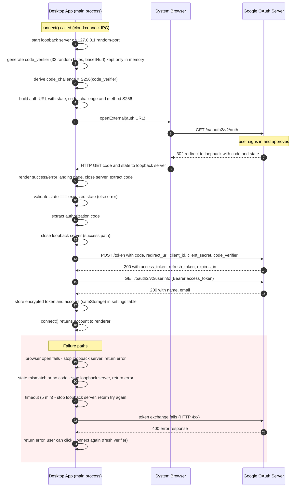
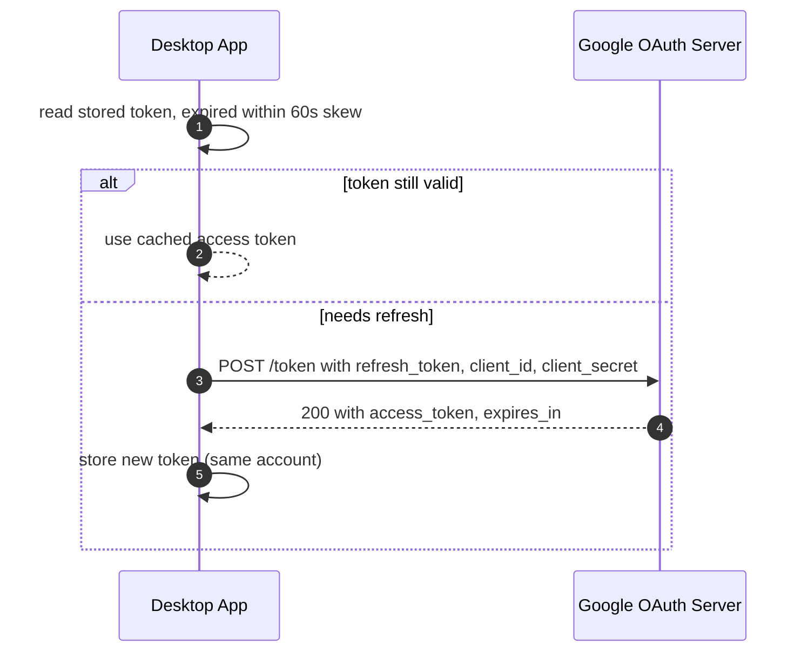

# Google Drive OAuth — PKCE Sequence Diagram

Actual flow implemented in `packages/desktop/src/main/cloud/googleDrive.ts`
(`runLoopbackOAuth`) and `packages/core/src/sync/cloud.ts`. The loopback
server binds to `http://127.0.0.1:<random-port>` (loopback IP literal per
RFC 8252 §7.3, so any port is accepted); the `code_verifier` is generated in
the main-process closure before the browser opens and is never persisted — it
exists only for the duration of the exchange. The redirect target page is
rendered by `packages/desktop/src/main/cloud/oauthLandingPage.ts`.

Refresh flow (`freshToken` / `refreshTokenFromStore` in
`packages/desktop/src/main/cloud/googleDrive.ts`) reuses the stored refresh
token; the access token is only kept for `expiresAt - 60s` skew before a
refresh is triggered:

## Notes

- **`drive.file` scope only** — the app can only see its own files/folders.
- **PKCE** satisfies OAuth 2.1 best practice; the loopback redirect keeps the
  code exchange inside the app's own local server.
- **`client_secret` is still sent** on exchange/refresh because Google's
  token endpoint requires it for Desktop clients even with PKCE; Google treats
  desktop client secrets as non-confidential (they ship in the app).
- **`code_verifier` is ephemeral**: generated per flow, held in the
  `runLoopbackOAuth` closure, never written to disk, discarded after exchange.
